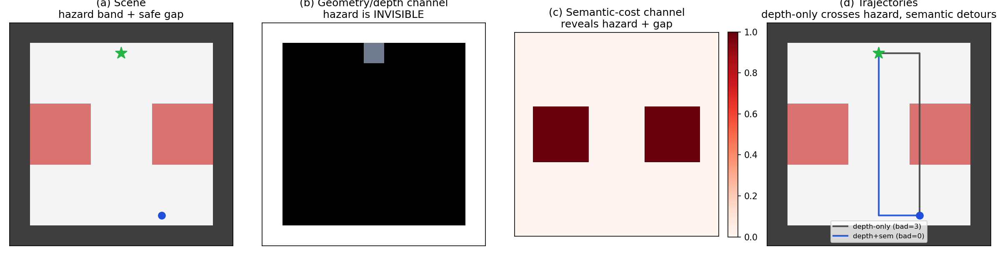
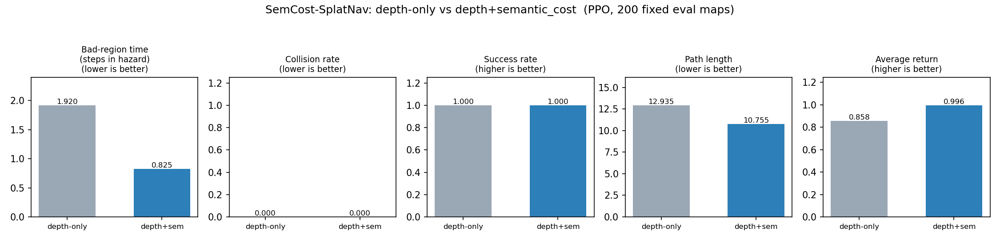
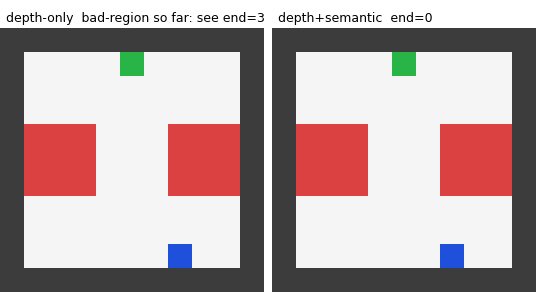
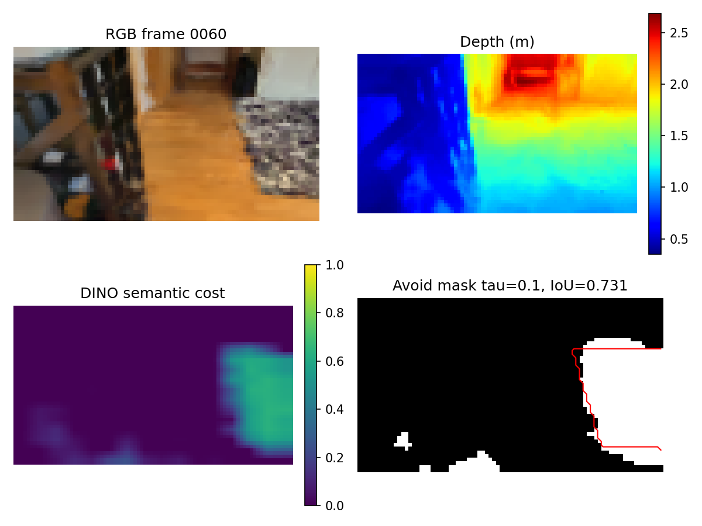

# SemCost-SplatNav

**A lightweight semantic-cost splatting prototype for visual RL** — preliminary
work toward *online semantic Gaussian-Splatting + reinforcement learning* for
agile mobile robots.

> **Why this repo exists.** I built this as preliminary work for the **RAI
> Institute × ETH Zurich master's thesis** *"extend a Gaussian-Splatting framework
> by integrating online semantics, and build an RL framework that draws from both
> geometry and semantics in real time"* (keywords: Gaussian Splatting,
> Semantics, VFM, Reinforcement Learning, 3D Vision). On a single laptop plus a
> small AWS budget, I set out to **validate the project's core premise** and
> **prototype the RL side end-to-end**, so I can hit the ground running on the
> full thesis rather than starting cold.

The thesis observes that photorealistic GS + vectorized physics (e.g. **GaussGym**,
>100k steps/s) lets policies train from RGB pixels, and that the next step is to
move *beyond depth* and exploit **visual semantics** — e.g. identifying and
avoiding undesirable regions in unstructured environments. This prototype isolates
and tests exactly that premise, at a scale a laptop can reach.

## How this prototype maps to the thesis work packages

| Thesis work package | What this prototype already shows |
|---|---|
| **WP1** — research 3DGS + semantic scene representations | Post-hoc **DINOv2 ViT-S → PCA** semantic-cost field on a real pretrained gsplat scene; GaussGym / gsplat renderer studied and a standalone renderer extracted (Stage-2 D0). |
| **WP2** — integrate online semantic splatting into a perceptive RL framework | **Premise validated** (offline): on a real splat, a hazard is **semantically estimable** (parity IoU 0.674) yet **geometrically invisible** in depth. The *online, renderer-internal* VFM feature splatting is the explicit next step (see [Toward the thesis](#toward-the-full-thesis-compute-gated)). |
| **WP3** — train visual nav/locomotion RL with semantic features | **Done in a controlled env**: PPO with a semantic-cost channel cuts hazardous-region exposure **−57%** at equal success. Realistic-scene RL (P3) is gated on compute. |
| **WP4** — deploy + evaluate on real robots | Future work. |

*Background this project exercises:* **Python / PyTorch, RL (PPO), 3D Vision /
Gaussian Splatting, VFM features (DINOv2)**. The thesis additionally calls for
C++, IsaacLab and ROS2 / real-robot work — directions I am eager to grow into and
have scoped (not yet exercised) here.

---

## The question

> When geometry/depth observations cannot distinguish hazardous regions, can an
> extra **semantic-cost** observation help a policy avoid them?

Tested in **two stages of increasing realism**, on one hypothesis:

- **Stage 1 — controlled grid, ground-truth semantics (done).** Isolates the
  information effect cleanly. Adding a semantic-cost channel cuts hazardous-region
  exposure by **−57%** at 100% success and zero collisions (200 paired seeds).
- **Stage 2 / P2 — real gsplat scene, *estimated* semantics (done).** On a real
  pretrained Gaussian-Splatting living-room scene, a post-hoc DINOv2 cost map
  **localizes a carpet hazard** (parity IoU **0.674**, leave-one-out **0.677**)
  while the hazard is **geometrically invisible** in depth (`depth_invariant`).
- **Stage 2 / P3 — 3-arm RL on the real scene (future work, compute-gated).** See
  [Toward the thesis](#toward-the-full-thesis-compute-gated).

This is a *prototype toward* online semantic Gaussian-Splatting + RL — **not** a
full integration of GaussGym/IsaacGym, and not (yet) renderer-internal VFM feature
splatting. See [Limitations](#limitations).

---

## Stage 1 — Controlled grid baseline (done)

**Setup.** PPO (Stable-Baselines3) with a small shared CNN on an 11×11 walled
arena. A horizontal **hazard band** crosses the arena with a single **safe gap**
whose column is randomized per episode. The band blocks no motion and **leaves no
geometric trace** — the `depth` observation is *provably identical* across gap
locations (verified in tests), so a depth-only agent cannot know where to cross;
the gap is revealed **only** by the semantic-cost channel. Two obs modes, identical
in everything but the extra channel: `depth` (1×21×21) vs `depth_semantic`
(2×21×21). Reward, dynamics, map distribution, horizon, PPO hyperparameters,
training seed and the 200-seed evaluation list are shared (runtime fairness
assertion). The semantic channel encodes hazard intensity only — never the goal
(leakage guard + test).



**Results (200 paired evaluation seeds, deterministic actions).**

| Metric | depth-only | depth + semantic_cost | Δ |
|---|---|---|---|
| success_rate | 1.000 | 1.000 | = |
| collision_rate | 0.000 | 0.000 | = |
| **bad_region_time** | **1.92** | **0.83** | **−57%** |
| path_length | 12.94 | 10.76 | shorter |
| average_return | 0.858 | 0.996 | higher |



Both policies solve the task; with geometry only the agent crosses the invisible
hazard, while the semantic channel lets it route through the safe gap — roughly
**halving hazardous-region exposure**. The headline rests on `bad_region_time` (a
safety metric), not reward alone. *Caveat: single training seed per mode — a
paired-evaluation result, not a training-variance claim.*

Side-by-side rollout on the same map (depth-only left, depth+semantic right):



---

## Stage 2 / P2 — Semantic-cost validation on a real gsplat scene (done)

**Goal.** Before any paid RL, validate the *premise* on a realistic scene: is the
hazard (a) **estimable** from RGB via a vision foundation model, and (b) **not**
already visible in geometry/depth?

**Setup.** A pretrained gsplat scene (HuggingFace `escontra/gauss_gym_arkit`,
`training/43895956` — a living room with a patterned **carpet** on wood floor),
rendered to 80 RGB-D frames (free Colab T4; **$0 AWS**). Carpet hand-labelled in 5
frames. Estimated semantic cost: per RGB frame, **DINOv2 ViT-S** patch features →
L2-norm → PCA(64, frozen) → cosine vs a few-shot carpet prototype → soft per-pixel
cost. All run locally on CPU.

**Result — two gates.**

| Gate | Metric | Value | Verdict |
|---|---|---|---|
| Semantics **see** the hazard | parity IoU (fixed τ=0.1) | **0.674** (per-frame 0.60–0.73) | ≥ 0.5 ✓ |
| | leave-one-out IoU (prototype from N−1 frames) | **0.677** | not overfitting ✓ |
| Depth does **not** | signed carpet step vs local floor-fit noise | 0.27 (std) / 0.72 (MAD), **sign inconsistent** across frames | `depth_invariant` ✓ |



*Depth (top-right) is a smooth perspective gradient — the carpet outline is
invisible; the DINO cost (bottom-left) localizes it; the avoid mask (bottom-right)
matches the human label (IoU 0.73 on this frame).*

The DINO cost localizes the carpet and generalizes across held-out frames; depth
shows **no systematic, sign-consistent geometric step above the rendering noise
floor** (a real step cannot flip sign between adjacent viewpoints — here it does).
This is the honest, *weaker* claim that the geometric signal is below noise, **not**
that the carpet has zero thickness. Both checks were independently reviewed over
multiple rounds; the estimated cost never encodes target position (leakage guard +
unit test); `pytest` 16 passed.

---

## Toward the full thesis (compute-gated)

What remains is exactly the thesis itself. Concretely:

### P3 — 3-arm RL on the real scene (future work, compute-gated)

The plan is `depth` / `rgb` / `rgb+semantic` arms (same net/reward/seed/steps,
only observation tokens differ), with the honest headline `rgb+semantic` vs `rgb`.
**It is not executed**: a serious GaussGym-scale, multi-seed RL run is beyond the
budget available here (a single AWS **g5.2xlarge** spot instance, ≤ \$50), which is
not enough compute for a reliable multi-arm × multi-seed comparison. This is a
direct fit for the thesis environment (GaussGym at 100k+ steps/s + RAI/ETH compute).
*Honest caveat:* even with compute, because the DINO cost is derived **from RGB**, a
plain RGB policy may already capture this visually-salient carpet — so a stronger
test would re-select a **visually subtle** hazard (RGB-hard but VFM-separable, e.g.
a same-colour traction/material transition) where an explicit semantic channel can
add value RGB cannot easily learn. The full plan, budget cap and AWS gates are in
[docs/AWS_FLAGSHIP_PLAN.md](docs/AWS_FLAGSHIP_PLAN.md).

### Hero — online, renderer-internal VFM feature splatting (WP2 core)

Instead of running DINOv2 *post-hoc* on rendered RGB, attach VFM features to the
Gaussians so semantic features render **jointly** with RGB-D in one rasterizer pass
— the architecture an online semantic-splatting + RL system would actually use.
This is the heart of WP2 and the natural continuation of P2.

### Multi-scene generalization, sim-to-real, real-robot deployment (WP3/WP4)

Train across several gsplat scenes; study sensitivity to splat quality, hazard
prototype, and semantic-estimation error; then deploy and evaluate on agile mobile
robots (IsaacLab / ROS2). Not addressed here; the env, policy and experiment
harness are structured to be reused as these pieces are swapped in.

---

## Limitations

**Stage 1.** Intentionally simple, geometry-ambiguous task to *isolate* the
information effect; top-down occupancy "depth" (not true sensor depth);
ground-truth semantics (a stand-in); single training seed per mode (paired eval).

**Stage 2 / P2.** Single scene, single hazard class; semantics estimated
**offline** from rendered RGB (post-hoc DINOv2), not jointly with the splat;
parity is a solid-but-moderate IoU 0.674 over **5 labelled frames** (small-sample
cross-frame consistency, not strong generalization); `depth_invariant` means
"below the local floor-fit noise floor" at 84×48 render resolution (floor-fit
residual std 6–14 cm), not zero-thickness coplanarity.

**Not claimed.** No full GaussGym / IsaacGym integration; no renderer-internal VFM
feature splatting (the Hero version); no RL result from estimated semantics on the
real scene (that is P3 / future work).

---

## Reproduce

### Stage 1 (CPU, single machine)

```bash
pip install -r requirements.txt

python scripts/run_experiment.py          # train + evaluate both modes (fairness-checked)
# or individually:
python scripts/train.py     --obs depth
python scripts/train.py     --obs depth_semantic
python scripts/evaluate.py  --obs depth
python scripts/evaluate.py  --obs depth_semantic
python scripts/plot_results.py
python scripts/render_rollout.py
python tests/test_env_smoke.py
```

### Stage 2 / P2 — semantic-cost validation (CPU)

```bash
pip install transformers==4.45.2        # DINOv2 via HF; CPU-only is fine
# (RGB-D frames + 5 carpet masks live under assets/p2_arkit_render/, gitignored)
python scripts/fit_dino_pca.py                                   # DINOv2 ViT-S -> PCA(64)
python scripts/build_bad_proto.py                               # few-shot carpet prototype
python scripts/build_semantic_cost.py --rgb-dir assets/p2_arkit_render/rgb
python scripts/eval_parity.py --threshold-scan                  # parity IoU vs human masks
python scripts/loo_parity.py                                    # leave-one-out IoU
python scripts/depth_invariance_check.py                        # geometry-invisibility test
python scripts/make_quad_figure.py                              # RGB/depth/cost/avoid figure
pytest tests/ -q
```

Outputs: `results/parity_report.json` (0.674), `results/parity_loo.json` (0.677),
`results/depth_invariance.json` (`depth_invariant`),
`figures/rgbd_cost_avoid_quad.png`. The full two-stage write-up is in
[REPORT.md](REPORT.md). Stage 2 / P3 AWS plan: [docs/AWS_FLAGSHIP_PLAN.md](docs/AWS_FLAGSHIP_PLAN.md).

---

## Repository layout

```
semcost_nav/   # Stage 1 package: env, maps, policy CNN, experiment config, metrics
               #  + semantic/dino_cost.py (Stage 2 DINOv2 cost mapper)
scripts/       # Stage 1: train, evaluate, run_experiment, plot_results, render_rollout
               # Stage 2/P2: fit_dino_pca, build_bad_proto, build_semantic_cost,
               #             eval_parity, loo_parity, depth_invariance_check,
               #             make_quad_figure, label_carpet_mask
               # Stage 2/P3: train_gaussgym, evaluate_gaussgym, run_flagship_overnight (scaffold)
configs/       # Stage 2: flagship.yaml (shared across all 3 arms)
tests/         # env smoke tests + Stage 2 fairness / no-target-leak tests
results/       # eval + parity JSON (binaries like PCA/prototype are gitignored, regenerable)
figures/       # generated figures, GIFs, MP4s
docs/          # AWS_FLAGSHIP_PLAN.md (Stage 2/P3 plan, budget, gates)
```

`.gitignore` covers training artifacts and regenerable binaries (PCA/prototype/
cost-map `.npy`/`.npz`, large renders); only small metrics, parity reports and
figures are committed. Stage-2 P3 checkpoints would live in S3, not git.
